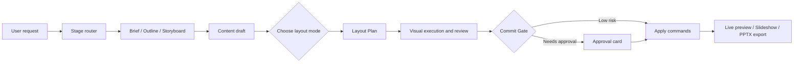

# Agent PPT

[中文](./README.md) · [Docs](./docs/README.md)


Agent PPT is a local-first AI workspace for presentations. It turns a rough request into reviewable brief, outline, storyboard, slide draft, layout plan, and PPTX export artifacts, making the model behave like a traceable presentation partner instead of a one-shot black box.

It is useful when you want to:

- Generate a report, proposal, class deck, or product presentation from scratch
- Add slides, rewrite copy, unify style, or beautify an existing deck
- Track brief, outline, storyboard, design theme, export history, and conversation context as local project files
- Study reliable AI document editing with tool calls, approvals, risk control, and visual review loops

## What Makes It Different

**It is staged collaboration, not one-shot generation.**  
Agent PPT routes work through `discover -> author -> design -> style -> edit -> export`. Large jobs produce brief / outline / storyboard artifacts first. Small edits take a lightweight path. After the content draft is ready, the app pauses for you to choose standard layout or creative decoration before visual execution begins.

**The model does not directly mutate the deck.**  
All real slide changes pass through `CommitGate`: schema validation, sandbox execution, diff generation, and risk evaluation. Changes can be auto-applied only when safe; otherwise the UI asks for your approval.

**The deck model is richer than text.**  
The internal presentation model supports text, images, shapes, charts, tables, icons, background variants, layouts, design tokens, themes, and palettes. Export converts those structures into a real `.pptx`.

**The process is preserved, not just the result.**  
Each session has a local project sandbox containing `brief.md`, `outline.md`, `slides/storyboard.json`, `slides/layout-plan.json`, `deck/snapshot.json`, transcripts, and export history, so the work can be reviewed, debugged, and continued later.

## Workflow



## In The App

- Start a new session from a focused AI input box
- Manage local sessions and workspaces from the left panel
- Confirm brief, outline, layout mode, and tool approvals inside the chat stream
- Inspect task plans, stage progress, tool calls, and sub-agent traces
- Open the right-side PPT mirror to select slides, present, export, or run global AI beautification
- Configure OpenAI or Anthropic models, endpoints, timeouts, output limits, and fallbacks
- Control theme, palette, logo, aspect ratio, light/dark mode, and visual preferences
- Use slash commands to change themes, add pages, delete pages, or rewrite local content

## Example Prompts

```text
Create an 8-slide product launch presentation for enterprise customers. Keep it professional but high-impact.
```

```text
Turn slide 3 into a left-right comparison: pain points on the left, our solution on the right.
```

```text
Apply a business blue theme across the whole deck and check for overflowing text.
```

```text
Export the current presentation as PPTX.
```

## Quick Start

```powershell
npm.cmd install
npm.cmd run dev
```

After launch, open **Settings -> 模型** in the desktop app to configure the provider, API key, endpoint, timeout, output limits, and fallback models.

API keys are kept in main-process memory for the current app session and are not written to `.env`. Developer diagnostics and CI overrides are documented in [.env.example](./.env.example).

## Commands

```powershell
npm.cmd run dev
npm.cmd test
npm.cmd run typecheck
npm.cmd run build
npm.cmd run preview
npm.cmd run generate:pptx
```

Platform packaging:

```powershell
npm.cmd run build:win
npm.cmd run build:mac
npm.cmd run build:linux
```

## Tech Stack

- Electron + electron-vite
- React 19 + TypeScript
- OpenAI SDK + Anthropic SDK
- pptxgenjs
- Zustand + Zod
- Vitest

## Architecture

```text
Renderer UI
  ChatWorkspace / PPTMirror / SettingsConsole
        |
        v
Preload IPC boundary
        |
        v
Main process
  Agent runtime -> Gateway -> OpenAI / Anthropic
  Tool registry -> Core tools + Deferred tools + Skills
  CommitGate -> CommandBus -> Presentation snapshot
  ProjectFileService -> local artifacts and transcripts
        |
        v
PPTX exporter
```

Key areas:

- `src/renderer/`: React workspace, chat stream, live PPT mirror, settings console
- `src/main/agent/`: Agent runtime, tool registry, model gateways, commit gate, sub-agents
- `src/shared/`: presentation model, command model, layout system, design tokens, session types
- `src/main/project/`: local project sandbox, artifact IO, diffs, dependency status
- `src/main/deck/`: thumbnails, export history, PPTX export services
- `skills/`: workflow skills for brief, outline, storyboard, layout, beautify, export, and review
- `tests/`: coverage for Agent behavior, layout, export, context compaction, approvals, and project artifacts

## Local Files And Privacy

Agent PPT is local-first by default:

- Sessions, project artifacts, transcripts, deck snapshots, and export history stay on your machine
- API keys are passed through app settings to the main process and are not written to repository env files
- The model can affect a deck only through registered tools and structured commands
- Risky or non-auto-applicable changes require user approval

## Documentation

- [docs/README.md](./docs/README.md): documentation index
- [docs/ppt-capability-status-plan.md](./docs/ppt-capability-status-plan.md): PPT capability status and roadmap
- [docs/ppt-quality-attention-plan.md](./docs/ppt-quality-attention-plan.md): slide generation quality and model attention improvement plan
- [docs/ppt-style-capability-plan.md](./docs/ppt-style-capability-plan.md): style capability roadmap
- [docs/visual-expression-system-plan.md](./docs/visual-expression-system-plan.md): visual expression system and Layout Grammar plan
- [docs/visual-vocabulary-plan.md](./docs/visual-vocabulary-plan.md): visual vocabulary and graphic expression plan
- [docs/background-tasks-plan.md](./docs/background-tasks-plan.md): background task plan

## Status

This is a fast-moving experimental desktop app. The current focus is reliable AI-assisted presentation production: requirement shaping, content generation, layout design, visual review, approval, preview, and PPTX export. The end-to-end skeleton is already in place; the highest-value next work is visual quality, reusable templates, import support, and stronger cross-session project management.
