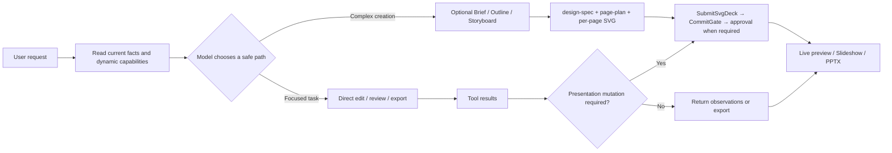
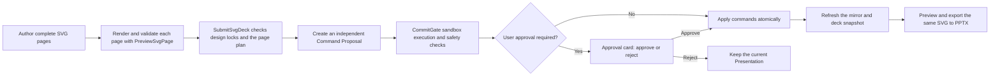

# Agent PPT

[中文](./README.md) · [Docs](./docs/README.en.md) · [文档索引](./docs/README.md)


Agent PPT is a local-first AI workspace for presentations. It creates reviewable briefs, outlines, storyboards, SVG pages, and PPTX exports when the task calls for them, making the model a tool-using, traceable presentation partner instead of a one-shot black box.

It is useful when you want to:

- Generate a report, proposal, class deck, or product presentation from scratch (SVG-native full-page authoring)
- Add slides, rewrite copy, or unify style on an existing deck (via agent skills and approvals)
- Track brief, outline, storyboard, design-spec, export history, and conversation context as local project files
- Study reliable AI document editing with tool calls, approvals, risk control, and visual review loops

## Screenshots

Three-column workspace: sessions and project files on the left, agent progress and approvals in the center, live slide preview on the right. Generated decks can enter slideshow mode directly, and preview and export share the same SVG visual source; Settings manages models, search and networking, submission and approval, usage and billing, and more. Screenshots below show the default UI shell and sample agent output.

<table>
  <tr>
    <td width="50%"><br/><sub>Three-column workspace</sub></td>
    <td width="50%"><br/><sub>Settings: usage and billing</sub></td>
  </tr>
  <tr>
    <td width="50%"><br/><sub>Slideshow sample: structured page</sub></td>
    <td width="50%"><br/><sub>Slideshow sample: dark creative cover</sub></td>
  </tr>
</table>

## Workbench theme customization

Workbench chrome is separate from the slide DesignSystem: drop a pack at `~/.agent-ppt/themes/<name>/theme.css` to restyle the app without changing SVG paper or PPTX export. The image below is a promotional shot of the built-in Catnip theme (not the default look).

<p align="center">
  
</p>

<p align="center"><sub>Catnip: folder CSS theme example · see the <a href="./docs/user-manual/css-themes.md">CSS theme guide</a></sub></p>

## What Makes It Different

**It is model-driven tool collaboration, not a fixed stage machine.**

The runtime gives the model current workspace facts, available skills, and a dynamic tool set. Complex creation jobs can optionally load upstream skills (brief / outline / storyboard / research; knowledge-only, written via WriteFile) then lock `design-spec` and per-page `page-plan` files; local edits, reviews, and exports can take a short path. Interaction pauses only for missing critical constraints, risky changes, or an explicitly requested comparison.

When creating a full deck, the agent locks a Design System from audience, topic, and delivery context, authors each page as a complete `1280 × 720` SVG, then submits through `PreviewSvgPage` → `SubmitSvgDeck` into a single proposal. It does not ask you to pick “standard layout” or “creative decoration” after a content draft, unless you explicitly want a content-only draft.

**The model does not directly mutate the deck.**

All real slide changes pass through `CommitGate`: schema validation, sandbox execution, diff generation, and risk evaluation. Changes can be auto-applied only when safe; otherwise the UI asks for your approval.

**The product create path is SVG-native.**

Each slide’s visual authoring source is a validated full-page SVG shared by preview and export. PPTX export uses a hybrid strategy: a text-stripped SVG becomes the slide background image, while title and body `<text>` nodes are lifted into editable PowerPoint text boxes. Charts and decoration stay in the image layer; they are not decomposed into native shapes or charts.

**The process is preserved, not just the result.**

The local workspace can contain task-specific artifacts such as `brief.md`, `outline.md`, `slides/storyboard.json`, `design/design-spec.json`, `slides/page-plan.json`, `slides/svg/*.svg`, and `deck/snapshot.json`. Dedicated persistence services retain history, checkpoints, transcripts, and export records for review and recovery.

## Workflow


```mermaid
flowchart LR
  A["User request"] --> B["Read current facts and dynamic capabilities"]
  B --> C{"Model chooses a safe path"}
  C -->|Complex creation| D["Optional Brief / Outline / Storyboard"]
  C -->|Focused task| E["Direct edit / review / export"]
  D --> F["design-spec + page-plan + per-page SVG"]
  E --> G["Tool results"]
  F --> I["SubmitSvgDeck → CommitGate → approval when required"]
  G --> H{"Presentation mutation required?"}
  H -->|Yes| I
  H -->|No| J["Return observations or export"]
  I --> K["Live preview / Slideshow / PPTX"]
  J --> K
```

## SVG-Native Full-Deck Generation

When creating or redesigning an entire presentation, the agent can use the SVG-native workflow and author every slide as a complete `1280 × 720` SVG. The SVG itself contains the title, body copy, background, charts, images, page number, and decoration; the preview and export layers do not add a second set of visual styling that could drift from the source.

Key workspace files:

- `design/design-spec.json`: locked communication contract and Design System
- `slides/page-plan.json`: slide order, final copy, and per-slide narrative intent
- `slides/svg/P01.svg`, etc.: complete slide visual sources
- `deck/snapshot.json`: the Presentation snapshot already approved and applied by the user

The submission path is:


```mermaid
flowchart LR
  A["Author complete SVG pages"] --> B["Render and validate each page with PreviewSvgPage"]
  B --> C["SubmitSvgDeck checks design locks and the page plan"]
  C --> D["Create an independent Command Proposal"]
  D --> E["CommitGate sandbox execution and safety checks"]
  E --> F{"User approval required?"}
  F -->|Yes| G["Approval card: approve or reject"]
  F -->|No| H["Apply commands atomically"]
  G -->|Approve| H
  G -->|Reject| I["Keep the current Presentation"]
  H --> J["Refresh the mirror and deck snapshot"]
  J --> K["Preview and export the same SVG to PPTX"]
```

Three completion states must remain distinct:

| State | Meaning |
|---|---|
| SVG workspace files complete | The page sources exist, but the current slides have not changed |
| Proposal created | Replacement commands passed preview and safety checks and are waiting for approval |
| Presentation applied | `CommandBus` executed the commands atomically and persisted the deck snapshot |

A successful `SubmitSvgDeck` result means that the Proposal was created; it does not mean the slides were already replaced. When approval is required, the SVG pages take effect only after the user approves the current proposal, the apply operation succeeds, and the right-side mirror reloads the authoritative Presentation.

Each agent run creates an independent proposal card. If one conversation thread produces several deck proposals, a later proposal cannot inherit the earlier proposal's “applied” state. When loading sessions created by an older version, the app also detects a resolved action that belongs to a different run and reactivates that proposal for review instead of reporting unapplied commands as complete.

## In The App

- Start a new chat from the centered AI input box with a natural-language request
- Switch between Agent Workspace, Project Files, and session search in the left panel
- Review briefs, outlines, combined content/visual proposals, and tool approval cards in the chat stream
- Inspect task plans, stage progress, tool calls, and sub-agent traces
- Use the right-side PPT mirror to select slides, present, export, or go fullscreen
- Configure models (OpenAI / Anthropic-compatible endpoints), runtime limits, and CommitGate approval policy in Settings
- Set a Tavily API key under **Settings -> 搜索与联网** for optional web research
- Review tokens, estimated cost, task success rate, and per-model breakdown under **Settings -> 用量与费用**
- Browse local Design System presets under presentation preferences (these do not write Agent `design-spec`)
- Use the slash menu to insert **prompt templates** (fills the input only; does not mutate the deck)

## Example Prompts

```text
Create an 8-slide product launch presentation for enterprise customers. Keep it professional but high-impact.
```

```text
Turn slide 3 into a left-right comparison: pain points on the left, our solution on the right.
```

```text
Apply a business blue theme across the whole deck and check for overflowing text.
```

```text
Export the current presentation as PPTX.
```

## Quick Start

```powershell
npm.cmd install
npm.cmd run dev
```

After launch, open **Settings -> 模型** in the desktop app to configure the provider, API key, endpoint, timeout, output limits, and fallback models.

Model and search API keys are owned by the Main process and encrypted in the application-data directory by Electron `safeStorage` when a secure backend is available. Renderer persistence, `localStorage`, and agent-run IPC payloads contain no secrets: the Renderer holds a key only while it is being entered, submits it through a write-only credential IPC, and cannot read it back. The Linux `basic_text` backend remains usable but is explicitly reported as `degraded`. Plaintext keys from the legacy v1 `localStorage` records are not imported automatically; after upgrading, re-enter the keys and rotate the old ones. Development environments can still use the `OPENAI_API_KEY`, `ANTHROPIC_API_KEY`, and `TAVILY_API_KEY` fallbacks; an environment key is sent only to an official endpoint or one explicitly bound by the matching `OPENAI_BASE_URL`, `ANTHROPIC_BASE_URL`, or `TAVILY_SEARCH_ENDPOINT`. Remote credential-bearing endpoints must use HTTPS, with HTTP allowed only for loopback development services. Developer diagnostics and CI overrides are documented in [.env.example](./.env.example).

For optional web research, set a Tavily API key under **Settings -> 搜索与联网**. You can also set `TAVILY_API_KEY` in development; search results return as title, URL, and snippet to the main agent and task-graph teammates.

Usage and billing live under **Settings -> 用量与费用**; metrics are stored in the local application-data directory.

## Commands

```powershell
npm.cmd run dev
npm.cmd test
npm.cmd run typecheck
npm.cmd run build
npm.cmd run preview
```

Platform packaging:

```powershell
npm.cmd run build:win
npm.cmd run build:mac
npm.cmd run build:linux
```

## Tech Stack

- Electron + electron-vite
- React 19 + TypeScript
- OpenAI SDK + Anthropic SDK
- pptxgenjs
- Zustand + Zod
- Vitest

## Architecture

```text
Renderer UI
  ChatWorkspace / PPTMirror / SettingsConsole
        |
        v
Preload IPC boundary
        |
        v
Main process
  Agent runtime -> Gateway -> OpenAI / Anthropic
  Tool registry -> Core tools + Skills
  CommitGate -> CommandBus -> Presentation snapshot
  ProjectFileService -> project artifacts and snapshots
  Conversation DB / Runtime stores -> history, checkpoints, transcripts
        |
        v
PPTX exporter (hybrid: SVG background + editable text)
```

Key areas:

- `src/renderer/`: React workspace, chat stream, live PPT mirror, settings console
- `src/main/agent/`: Agent runtime, tool registry, model gateways, commit gate, sub-agents
- `src/design-system/`: DesignSystemV2 schema, presets, and resolution
- `src/shared/`: presentation model, command model, session and IPC types
- `src/main/project/`: local project sandbox, artifact IO, diffs, dependency status
- `src/main/deck/`: thumbnails, export history, PPTX export services
- `skills/`: core create `ppt-workflow` → `ppt-design` → `ppt-design-layout` → `ppt-build`; short paths `ppt-edit` / `ppt-beautify` / `ppt-review` / `ppt-export`; optional upstream skills (`ppt-brief` / `ppt-outline` / `ppt-storyboard` / `ppt-research`) are knowledge-only and written via ReadFile/WriteFile — not lifecycle hard locks
- `tests/`: coverage for Agent behavior, export, context compaction, approvals, and project artifacts

## Local Files And Privacy

Agent PPT is local-first by default:

- Project artifacts and deck snapshots stay in the workspace; history, checkpoints, transcripts, usage metrics, and some settings may live in the local application-data directory
- API keys are managed by the Main-process Electron `safeStorage` credential store, not Renderer `localStorage` or agent-run IPC; development environment-variable fallbacks remain supported
- The model can affect a deck only through registered tools and structured commands
- Risky or non-auto-applicable changes require user approval

## Documentation

- [docs/README.md](./docs/README.md): documentation index
- [Architecture overview](./docs/architecture/overview.md): current layers, data flow, and state boundaries
- [Engineering capability map](./docs/architecture/engineering-capabilities.md): current capability mappings, maturity, and gaps
- [Query and Agent Loop](./docs/agent/query.md): QueryParams, State, Workspace, events, and recovery
- [Tools and file operations](./docs/agent/tools.md): dynamic capabilities, permissions, and Read/Write/Edit contracts
- [System Prompt and Context](./docs/agent/system-context.md): section registry and stable/dynamic boundaries
- [Presentation workflow](./docs/presentation/workflow.md): artifacts, proposals, CommitGate, and delivery states

## Status

This is a fast-moving experimental desktop app. The current focus is reliable AI-assisted presentation production: requirement shaping, content generation, layout design, visual review, approval, preview, and PPTX export. Current architecture and unfinished roadmap work are documented separately.
