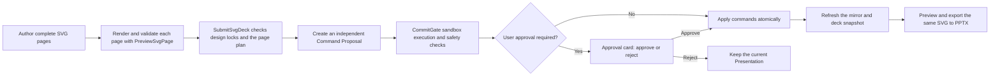

# Agent PPT

[中文](./README.md) · [Docs](./docs/README.md)


Agent PPT is a local-first AI workspace for presentations. It creates reviewable briefs, outlines, storyboards, slide drafts, layout plans, or PPTX exports when the task calls for them, making the model a tool-using, traceable presentation partner instead of a one-shot black box.

It is useful when you want to:

- Generate a report, proposal, class deck, or product presentation from scratch
- Add slides, rewrite copy, unify style, or beautify an existing deck
- Track brief, outline, storyboard, design theme, export history, and conversation context as local project files
- Study reliable AI document editing with tool calls, approvals, risk control, and visual review loops

## Screenshots

Three-column workspace: sessions and project files on the left, agent progress and approvals in the center, live slide preview on the right. Generated decks can enter slideshow mode directly, and preview and export share the same SVG visual source; Settings manages models, search and networking, submission and approval, usage and billing, and more. The slides below (structured onboarding page, dark creative cover) are sample agent output, not product branding.

<table>
  <tr>
    <td width="50%"><br/><sub>Three-column workspace</sub></td>
    <td width="50%"><br/><sub>Settings: usage and billing</sub></td>
  </tr>
  <tr>
    <td width="50%"><br/><sub>Slideshow sample: structured page</sub></td>
    <td width="50%"><br/><sub>Slideshow sample: dark creative cover</sub></td>
  </tr>
</table>

## What Makes It Different

**It is model-driven tool collaboration, not a fixed stage machine.**

The runtime gives the model current workspace facts, available skills, and a dynamic tool set. Complex creation jobs can produce Brief / Outline / Storyboard / Layout Plan artifacts as needed; local edits, reviews, and exports can take a short path. Interaction pauses only for missing critical constraints, risky changes, or an explicitly requested comparison.

When creating a full deck or a batch of pages, the agent chooses a Design System and per-slide layouts from audience, topic, and delivery context, then merges content and visual commands into a single proposal. It does not ask you to pick “standard layout” or “creative decoration” after a content draft, unless you explicitly want a content-only draft.

**The model does not directly mutate the deck.**

All real slide changes pass through `CommitGate`: schema validation, sandbox execution, diff generation, and risk evaluation. Changes can be auto-applied only when safe; otherwise the UI asks for your approval.

**The deck model is richer than text and also supports SVG-native pages.**

The internal presentation model supports text, images, shapes, charts, tables, icons, background variants, layouts, design tokens, themes, and palettes. Structured slides are converted into native PowerPoint elements. SVG-native slides use a validated full-page SVG as the shared visual source of truth for preview and export, keeping the in-app result consistent with the exported `.pptx`.

**The process is preserved, not just the result.**

The local workspace can contain task-specific artifacts such as `brief.md`, `outline.md`, `slides/storyboard.json`, `slides/layout-plan.json`, and `deck/snapshot.json`. Dedicated persistence services retain history, checkpoints, transcripts, and export records for review and recovery.

## Workflow


```mermaid
flowchart LR
  A["User request"] --> B["Read current facts and dynamic capabilities"]
  B --> C{"Model chooses a safe path"}
  C -->|Complex creation| D["Optional Brief / Outline / Storyboard / Layout Plan"]
  C -->|Focused task| E["Direct edit / review / export"]
  D --> F["Content + Design System + per-slide layouts"]
  E --> G["Tool results"]
  F --> I["Single Proposal → CommitGate → approval when required"]
  G --> H{"Presentation mutation required?"}
  H -->|Yes| I
  H -->|No| J["Return observations or export"]
  I --> K["Live preview / Slideshow / PPTX"]
  J --> K
```

## SVG-Native Full-Deck Generation

When creating or redesigning an entire presentation, the agent can use the SVG-native workflow and author every slide as a complete `1280 × 720` SVG. The SVG itself contains the title, body copy, background, charts, images, page number, and decoration; the preview and export layers do not add a second set of visual styling that could drift from the source.

Key workspace files:

- `design/design-spec.json`: locked communication contract and Design System
- `slides/page-plan.json`: slide order, final copy, and per-slide narrative intent
- `slides/svg/P01.svg`, etc.: complete slide visual sources
- `deck/snapshot.json`: the Presentation snapshot already approved and applied by the user

The submission path is:


```mermaid
flowchart LR
  A["Author complete SVG pages"] --> B["Render and validate each page with PreviewSvgPage"]
  B --> C["SubmitSvgDeck checks design locks and the page plan"]
  C --> D["Create an independent Command Proposal"]
  D --> E["CommitGate sandbox execution and safety checks"]
  E --> F{"User approval required?"}
  F -->|Yes| G["Approval card: approve or reject"]
  F -->|No| H["Apply commands atomically"]
  G -->|Approve| H
  G -->|Reject| I["Keep the current Presentation"]
  H --> J["Refresh the mirror and deck snapshot"]
  J --> K["Preview and export the same SVG to PPTX"]
```

Three completion states must remain distinct:

| State | Meaning |
|---|---|
| SVG workspace files complete | The page sources exist, but the current slides have not changed |
| Proposal created | Replacement commands passed preview and safety checks and are waiting for approval |
| Presentation applied | `CommandBus` executed the commands atomically and persisted the deck snapshot |

A successful `SubmitSvgDeck` result means that the Proposal was created; it does not mean the slides were already replaced. When approval is required, the SVG pages take effect only after the user approves the current proposal, the apply operation succeeds, and the right-side mirror reloads the authoritative Presentation.

Each agent run creates an independent proposal card. If one conversation thread produces several deck proposals, a later proposal cannot inherit the earlier proposal's “applied” state. When loading sessions created by an older version, the app also detects a resolved action that belongs to a different run and reactivates that proposal for review instead of reporting unapplied commands as complete.

## In The App

- Start a new chat from the centered AI input box with a natural-language request
- Switch between Agent Workspace, Project Files, and session search in the left panel
- Review briefs, outlines, combined content/visual proposals, and tool approval cards in the chat stream
- Inspect task plans, stage progress, tool calls, and sub-agent traces
- Use the right-side PPT mirror to select slides, present, export, go fullscreen, or run global AI beautification
- Configure models (OpenAI / Anthropic-compatible endpoints), runtime limits, and CommitGate approval policy in Settings
- Set a Tavily API key under **Settings -> 搜索与联网** for optional web research
- Review tokens, estimated cost, task success rate, and per-model breakdown under **Settings -> 用量与费用**
- Control theme, palette, logo, aspect ratio, and light/dark preferences under presentation and appearance settings
- Use slash commands to change themes, add pages, delete pages, or rewrite local content

## Example Prompts

```text
Create an 8-slide product launch presentation for enterprise customers. Keep it professional but high-impact.
```

```text
Turn slide 3 into a left-right comparison: pain points on the left, our solution on the right.
```

```text
Apply a business blue theme across the whole deck and check for overflowing text.
```

```text
Export the current presentation as PPTX.
```

## Quick Start

```powershell
npm.cmd install
npm.cmd run dev
```

After launch, open **Settings -> 模型** in the desktop app to configure the provider, API key, endpoint, timeout, output limits, and fallback models.

Model and search API keys are currently stored as plaintext in Renderer `localStorage` and passed to the main process when used. They are not automatically written to the repository `.env`, but they are not yet protected by an operating-system credential vault. Treat the local user account as the trust boundary. Developer diagnostics and CI overrides are documented in [.env.example](./.env.example).

For optional web research, set a Tavily API key under **Settings -> 搜索与联网**. You can also set `TAVILY_API_KEY` in development; search results return as title, URL, and snippet to the main agent and task-graph teammates.

Usage and billing live under **Settings -> 用量与费用**; metrics are stored in the local application-data directory.

## Commands

```powershell
npm.cmd run dev
npm.cmd test
npm.cmd run typecheck
npm.cmd run build
npm.cmd run preview
npm.cmd run generate:pptx
```

Platform packaging:

```powershell
npm.cmd run build:win
npm.cmd run build:mac
npm.cmd run build:linux
```

## Tech Stack

- Electron + electron-vite
- React 19 + TypeScript
- OpenAI SDK + Anthropic SDK
- pptxgenjs
- Zustand + Zod
- Vitest

## Architecture

```text
Renderer UI
  ChatWorkspace / PPTMirror / SettingsConsole
        |
        v
Preload IPC boundary
        |
        v
Main process
  Agent runtime -> Gateway -> OpenAI / Anthropic
  Tool registry -> Core tools + Deferred tools + Skills
  CommitGate -> CommandBus -> Presentation snapshot
  ProjectFileService -> project artifacts and snapshots
  Conversation DB / Runtime stores -> history, checkpoints, transcripts
        |
        v
PPTX exporter
```

Key areas:

- `src/renderer/`: React workspace, chat stream, live PPT mirror, settings console
- `src/main/agent/`: Agent runtime, tool registry, model gateways, commit gate, sub-agents
- `src/shared/`: presentation model, command model, layout system, design tokens, session types
- `src/main/project/`: local project sandbox, artifact IO, diffs, dependency status
- `src/main/deck/`: thumbnails, export history, PPTX export services
- `skills/`: workflow skills for brief, outline, storyboard, layout, beautify, export, and review
- `tests/`: coverage for Agent behavior, layout, export, context compaction, approvals, and project artifacts

## Local Files And Privacy

Agent PPT is local-first by default:

- Project artifacts and deck snapshots stay in the workspace; history, checkpoints, transcripts, usage metrics, and some settings may live in the local application-data directory
- API keys currently remain as plaintext in Renderer `localStorage` and are not written to repository environment files
- The model can affect a deck only through registered tools and structured commands
- Risky or non-auto-applicable changes require user approval

## Documentation

- [docs/README.md](./docs/README.md): documentation index
- [Architecture overview](./docs/architecture/overview.md): current layers, data flow, and state boundaries
- [Engineering capability map](./docs/architecture/engineering-capabilities.md): Claude Code reference capabilities, current mappings, and gaps
- [Query and Agent Loop](./docs/agent/query.md): QueryParams, State, Workspace, events, and recovery
- [Tools and file operations](./docs/agent/tools.md): dynamic capabilities, permissions, and Read/Write/Edit contracts
- [System Prompt and Context](./docs/agent/system-context.md): section registry and stable/dynamic boundaries
- [Presentation workflow](./docs/presentation/workflow.md): artifacts, proposals, CommitGate, and delivery states

## Status

This is a fast-moving experimental desktop app. The current focus is reliable AI-assisted presentation production: requirement shaping, content generation, layout design, visual review, approval, preview, and PPTX export. Current architecture and unfinished roadmap work are documented separately.
