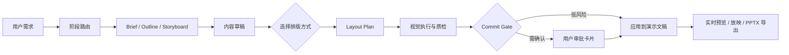

# Agent PPT

[English](./README.en.md) · [文档索引](./docs/README.md)


Agent PPT 是一个本地优先的 AI 演示文稿工作台。它把一句粗糙需求拆成可确认的 Brief、大纲、分镜、内容草稿、排版计划和 PPTX 导出，让模型像一个会交付过程稿的演示设计搭档，而不是一次性吐出不可控的黑箱文件。

它尤其适合这些场景：

- 从零生成一套汇报、方案、课程或产品介绍 PPT
- 在已有稿件上追加页面、改写文案、统一风格或一键美化
- 用本地项目文件追踪 Brief、大纲、分镜、设计主题、导出记录和对话过程
- 研究“AI 如何可靠地参与文档编辑”，包括工具调用、审批、风险控制和视觉质检

## 为什么不一样

**不是一次性生成，而是分阶段协作。**  
Agent PPT 会按 `discover -> author -> design -> style -> edit -> export` 路由任务。大任务先产出 Brief / Outline / Storyboard，小任务直接走轻量编辑；内容草稿完成后会停下来等你选择标准排版或创意装饰，再继续执行视觉排版。

**不是让模型直接改文件，而是让模型提交结构化命令。**  
所有真实幻灯片修改都会进入 `CommitGate`：先做 schema 校验、沙箱执行、diff 摘要和风险评估，再自动应用或请求用户确认。你能看到模型想改什么，也能拒绝它。

**不是只会写文字，而是有完整的演示文稿模型。**  
内部文档模型支持文本、图片、形状、图表、表格、图标、背景变体、版式、设计 token、主题和调色板。导出时会把这些结构转换成真正的 `.pptx`。

**不是只保留最终结果，而是保留制作过程。**  
每个会话都有本地项目沙箱，包含 `brief.md`、`outline.md`、`slides/storyboard.json`、`slides/layout-plan.json`、`deck/snapshot.json`、transcript 和导出历史，便于复盘、调试和继续迭代。

## 工作流一览



## 你能在应用里做什么

- 用居中的 AI 输入框新建会话，输入自然语言需求开始生成
- 在左侧管理本地会话和工作区
- 在聊天流里确认 Brief、大纲、排版方式和工具审批
- 查看 Agent 的任务计划、阶段进度、工具调用和子任务执行痕迹
- 打开右侧 PPT 实时预览，选择页面、放映、导出或触发全局 AI 美化
- 选择 OpenAI 或 Anthropic 模型，并配置 endpoint、timeout、输出上限和 fallback 模型
- 通过主题、调色板、Logo、比例、深浅色和视觉参数控制演示风格
- 使用斜杠指令快速改主题、加页、删页或重写局部内容

## 示例指令

```text
帮我做一份 8 页的产品发布会演示，面向企业客户，语气专业但有冲击力。
```

```text
把第 3 页改成左右对比结构，左边讲现状痛点，右边讲我们的解决方案。
```

```text
将整套演示统一成商务蔚蓝主题，并检查文字是否溢出。
```

```text
导出当前演示文稿为 PPTX。
```

## 快速开始

```powershell
npm.cmd install
npm.cmd run dev
```

启动后，在桌面应用里打开 **Settings -> 模型**，配置模型供应商、API Key、端点、超时、输出上限和 fallback 模型。

API Key 会保存在主进程内存中，仅用于当前应用会话，不会写入 `.env`。开发诊断和 CI 覆盖项可以参考 [.env.example](./.env.example)。

如需让 Agent 联网调研，请在 **Settings -> 生成参数** 填写 Tavily API Key。开发环境也可设置 `TAVILY_API_KEY`；搜索结果会以标题、URL 和摘要返回给主 Agent 及 Task 子 Agent。

## 常用命令

```powershell
npm.cmd run dev
npm.cmd test
npm.cmd run typecheck
npm.cmd run build
npm.cmd run preview
npm.cmd run generate:pptx
```

平台打包：

```powershell
npm.cmd run build:win
npm.cmd run build:mac
npm.cmd run build:linux
```

## 技术栈

- Electron + electron-vite
- React 19 + TypeScript
- OpenAI SDK + Anthropic SDK
- pptxgenjs
- Zustand + Zod
- Vitest

## 架构要点

```text
Renderer UI
  ChatWorkspace / PPTMirror / SettingsConsole
        |
        v
Preload IPC boundary
        |
        v
Main process
  Agent runtime -> Gateway -> OpenAI / Anthropic
  Tool registry -> Core tools + Deferred tools + Skills
  CommitGate -> CommandBus -> Presentation snapshot
  ProjectFileService -> local artifacts and transcripts
        |
        v
PPTX exporter
```

关键模块：

- `src/renderer/`：React 工作台、聊天流、实时 PPT 镜像、设置台
- `src/main/agent/`：Agent runtime、工具注册、模型网关、审批门禁、子任务
- `src/shared/`：演示文稿模型、命令模型、布局系统、设计 token、会话类型
- `src/main/project/`：本地项目沙箱、产物读写、diff 和依赖状态
- `src/main/deck/`：缩略图、导出历史、PPTX 导出服务
- `skills/`：PPT brief、outline、storyboard、layout、beautify、export、review 等工作流能力
- `tests/`：Agent、布局、导出、上下文压缩、工具审批和项目产物测试

## 本地文件与隐私

Agent PPT 的默认运行方式是本地优先：

- 会话、项目产物、transcript、deck snapshot 和导出历史保存在本机工作区
- API Key 由应用设置传入主进程使用，不写入仓库环境文件
- 模型只能通过已注册工具和结构化命令影响演示文稿
- 高风险或不可自动应用的变更会要求用户审批

## 文档

- [docs/README.md](./docs/README.md)：文档索引
- [docs/ppt-capability-status-plan.md](./docs/ppt-capability-status-plan.md)：PPT 能力状态与建设计划
- [docs/ppt-quality-attention-plan.md](./docs/ppt-quality-attention-plan.md)：PPT 生成质量与模型注意力改进计划
- [docs/ppt-style-capability-plan.md](./docs/ppt-style-capability-plan.md)：样式表达能力建设方案
- [docs/visual-expression-system-plan.md](./docs/visual-expression-system-plan.md)：视觉表达系统与 Layout Grammar 计划
- [docs/visual-vocabulary-plan.md](./docs/visual-vocabulary-plan.md)：视觉词汇与图形表达计划
- [docs/background-tasks-plan.md](./docs/background-tasks-plan.md)：后台任务计划

## 当前状态

这是一个快速演进中的实验型桌面应用。当前重点是把“可控的 AI 演示文稿制作”跑通：从需求澄清、内容生成、排版设计、视觉质检，到审批、预览和 PPTX 导出。代码里已经具备完整的端到端骨架，接下来最值得投入的是视觉质量、更多可复用模板、导入能力和更强的跨会话项目管理。
