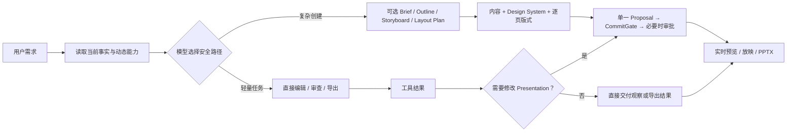
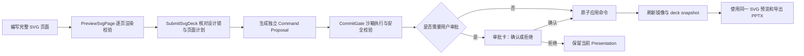

# Agent PPT

[English](./README.en.md) · [文档索引](./docs/README.md)


Agent PPT 是一个本地优先的 AI 演示文稿工作台。它会根据任务需要生成可确认的 Brief、大纲、分镜、一体化内容与视觉方案、排版计划或 PPTX，让模型像一个会使用工具并交付证据的演示设计搭档，而不是一次性吐出不可控的黑箱文件。

它尤其适合这些场景：

- 从零生成一套汇报、方案、课程或产品介绍 PPT
- 在已有稿件上追加页面、改写文案、统一风格或一键美化
- 用本地项目文件追踪 Brief、大纲、分镜、设计主题、导出记录和对话过程
- 研究“AI 如何可靠地参与文档编辑”，包括工具调用、审批、风险控制和视觉质检

## 界面一览

三栏工作台：左侧管理会话与项目文件，中间查看 Agent 过程与审批，右侧实时预览幻灯片。Agent 生成的演示可直接进入放映，预览与导出共用同一套 SVG 视觉源；设置台可管理模型、搜索与联网、提交与审批、用量与费用等。下方样张（入职培训结构化页、深色创意封面）为 Agent 生成示例，不是产品品牌。

<table>
  <tr>
    <td width="50%"><br/><sub>三栏工作台</sub></td>
    <td width="50%"><br/><sub>设置：用量与费用</sub></td>
  </tr>
  <tr>
    <td width="50%"><br/><sub>放映示例：结构化页面</sub></td>
    <td width="50%"><br/><sub>放映示例：深色创意封面</sub></td>
  </tr>
</table>

## 为什么不一样

**不是固定阶段机，而是模型驱动的工具协作。**

Runtime 向模型提供当前 workspace 事实、可用 Skill 和动态工具。复杂创建任务可以按需产出 Brief / Outline / Storyboard / Layout Plan；局部编辑、审查或导出可以直接走短路径。只有缺少关键约束、发生高风险变更或用户明确要求比较方案时才暂停交互。

新建整套 PPT 或批量创建页面时，Agent 默认依据受众、主题和交付场景自主选择 Design System 与逐页版式，并把内容和视觉命令合并成一个 proposal；不会在内容草稿后要求用户再选“标准排版”或“创意装饰”。用户明确只要内容草稿时除外。

**不是让模型直接改文件，而是让模型提交结构化命令。**

所有真实幻灯片修改都会进入 `CommitGate`：先做 schema 校验、沙箱执行、diff 摘要和风险评估，再自动应用或请求用户确认。你能看到模型想改什么，也能拒绝它。

**不是只会写文字，而是有完整的演示文稿模型和 SVG 页面模式。**

内部文档模型支持文本、图片、形状、图表、表格、图标、背景变体、版式、设计 token、主题和调色板。结构化页面会转换为原生 PowerPoint 元素；SVG-native 页面则以经过校验的整页 SVG 作为预览和导出的共同视觉事实源，确保应用内看到的效果与导出的 `.pptx` 一致。

**不是只保留最终结果，而是保留制作过程。**

本地 workspace 会按任务产生 `brief.md`、`outline.md`、`slides/storyboard.json`、`slides/layout-plan.json`、`deck/snapshot.json` 等 artifact；History、checkpoint、transcript 和导出记录由各自的持久化服务维护，便于复盘、调试和继续迭代。

## 工作流一览


```mermaid
flowchart LR
  A["用户需求"] --> B["读取当前事实与动态能力"]
  B --> C{"模型选择安全路径"}
  C -->|复杂创建| D["可选 Brief / Outline / Storyboard / Layout Plan"]
  C -->|轻量任务| E["直接编辑 / 审查 / 导出"]
  D --> F["内容 + Design System + 逐页版式"]
  E --> G["工具结果"]
  F --> I["单一 Proposal → CommitGate → 必要时审批"]
  G --> H{"需要修改 Presentation？"}
  H -->|是| I
  H -->|否| J["直接交付观察或导出结果"]
  I --> K["实时预览 / 放映 / PPTX"]
  J --> K
```

## SVG-native 整套生成

新建或重做整套演示文稿时，Agent 可以使用 SVG-native 流程，把每一页完整设计为一份 `1280 × 720` SVG。标题、正文、背景、图表、图片、页码和装饰都由 SVG 自身提供，预览器和导出器不会再补一套可能不一致的视觉样式。

工作区中的关键文件：

- `design/design-spec.json`：沟通契约与 Design System 锁定文件
- `slides/page-plan.json`：页面顺序、文案和逐页叙事意图
- `slides/svg/P01.svg` 等：完整页面视觉源
- `deck/snapshot.json`：用户已经确认并应用的 Presentation 快照

提交链路如下：


```mermaid
flowchart LR
  A["编写完整 SVG 页面"] --> B["PreviewSvgPage 逐页渲染校验"]
  B --> C["SubmitSvgDeck 核对设计锁与页面计划"]
  C --> D["生成独立 Command Proposal"]
  D --> E["CommitGate 沙箱执行与安全校验"]
  E --> F{"是否需要用户审批"}
  F -->|是| G["审批卡：确认或拒绝"]
  F -->|否| H["原子应用命令"]
  G -->|确认| H
  G -->|拒绝| I["保留当前 Presentation"]
  H --> J["刷新镜像与 deck snapshot"]
  J --> K["使用同一 SVG 预览和导出 PPTX"]
```

这里有三个不同的完成状态：

| 状态 | 含义 |
|---|---|
| SVG 工作文件完成 | 页面源文件已经生成，但尚未改变当前幻灯片 |
| Proposal 已生成 | 替换命令已通过预览和安全校验，正在等待审批 |
| Presentation 已应用 | 命令已经由 `CommandBus` 原子执行，并写入 deck snapshot |

`SubmitSvgDeck` 返回成功只表示 Proposal 已建立，不等于幻灯片已经替换。需要审批时，只有用户在当前提案卡点击确认、应用返回成功，并且右侧镜像重新读取权威 Presentation 后，新的 SVG 页面才算真正生效。

每次 Agent Run 产生的 Proposal 都有独立审批卡。同一对话线程连续生成多套方案时，后一个提案不会继承前一个提案的“已应用”状态。对于旧版本曾错误复用审批卡的会话，应用重新加载时会检测审批动作与提案 Run 不一致的记录，并把该卡恢复为待审核，避免把未执行的替换误报为已完成。

## 你能在应用里做什么

- 用居中的 AI 输入框新建对话，输入自然语言需求开始生成
- 在左侧切换 Agent 工作区、浏览项目文件、搜索历史会话
- 在聊天流里审阅 Brief、大纲、一体化内容与视觉方案，以及必要的工具审批卡
- 查看 Agent 的任务计划、阶段进度、工具调用和子任务执行痕迹
- 打开右侧 PPT 镜像：选页、放映、导出、全屏，或触发全局 AI 美化
- 在 Settings 配置模型（OpenAI / Anthropic 兼容端点）、运行参数、提交与审批策略
- 在 **Settings -> 搜索与联网** 配置 Tavily，让 Agent 可做联网调研
- 在 **Settings -> 用量与费用** 查看 Token、预估费用、任务成功率与按模型分摊
- 通过演示与品牌、界面外观控制主题、调色板、Logo、比例和深浅色
- 使用斜杠指令快速改主题、加页、删页或重写局部内容

## 示例指令

```text
帮我做一份 8 页的产品发布会演示，面向企业客户，语气专业但有冲击力。
```

```text
把第 3 页改成左右对比结构，左边讲现状痛点，右边讲我们的解决方案。
```

```text
将整套演示统一成商务蔚蓝主题，并检查文字是否溢出。
```

```text
导出当前演示文稿为 PPTX。
```

## 快速开始

```powershell
npm.cmd install
npm.cmd run dev
```

启动后，在桌面应用里打开 **Settings -> 模型**，配置模型供应商、API Key、端点、超时、输出上限和 fallback 模型。

当前模型与搜索 API Key 会以明文保存在 Renderer 的 `localStorage`，并在调用时传给主进程；它们不会自动写入仓库 `.env`，但也尚未使用系统凭据库加密。请把本机用户账户视为信任边界。开发诊断和 CI 覆盖项可以参考 [.env.example](./.env.example)。

如需让 Agent 联网调研，请在 **Settings -> 搜索与联网** 填写 Tavily API Key。开发环境也可设置 `TAVILY_API_KEY`；搜索结果会以标题、URL 和摘要返回给主 Agent 及任务图 teammate。

用量与费用可在 **Settings -> 用量与费用** 查看；数据保存在本机应用数据目录。

## 常用命令

```powershell
npm.cmd run dev
npm.cmd test
npm.cmd run typecheck
npm.cmd run build
npm.cmd run preview
npm.cmd run generate:pptx
```

平台打包：

```powershell
npm.cmd run build:win
npm.cmd run build:mac
npm.cmd run build:linux
```

## 技术栈

- Electron + electron-vite
- React 19 + TypeScript
- OpenAI SDK + Anthropic SDK
- pptxgenjs
- Zustand + Zod
- Vitest

## 架构要点

```text
Renderer UI
  ChatWorkspace / PPTMirror / SettingsConsole
        |
        v
Preload IPC boundary
        |
        v
Main process
  Agent runtime -> Gateway -> OpenAI / Anthropic
  Tool registry -> Core tools + Deferred tools + Skills
  CommitGate -> CommandBus -> Presentation snapshot
  ProjectFileService -> project artifacts and snapshots
  Conversation DB / Runtime stores -> history, checkpoints, transcripts
        |
        v
PPTX exporter
```

关键模块：

- `src/renderer/`：React 工作台、聊天流、实时 PPT 镜像、设置台
- `src/main/agent/`：Agent runtime、工具注册、模型网关、审批门禁、子任务
- `src/shared/`：演示文稿模型、命令模型、布局系统、设计 token、会话类型
- `src/main/project/`：本地项目沙箱、产物读写、diff 和依赖状态
- `src/main/deck/`：缩略图、导出历史、PPTX 导出服务
- `skills/`：PPT brief、outline、storyboard、layout、beautify、export、review 等工作流能力
- `tests/`：Agent、布局、导出、上下文压缩、工具审批和项目产物测试

## 本地文件与隐私

Agent PPT 的默认运行方式是本地优先：

- 项目产物与 deck snapshot 保存在 workspace；History、checkpoint、transcript、用量统计和部分设置也可能保存在本机应用数据目录
- API Key 当前明文保存在 Renderer `localStorage`，不写入仓库环境文件
- 模型只能通过已注册工具和结构化命令影响演示文稿
- 高风险或不可自动应用的变更会要求用户审批

## 文档

- [docs/README.md](./docs/README.md)：文档索引
- [架构总览](./docs/architecture/overview.md)：现行分层、数据流与状态边界
- [工程能力地图](./docs/architecture/engineering-capabilities.md)：当前能力落点、成熟度与缺口
- [Query 与 Agent Loop](./docs/agent/query.md)：QueryParams、State、Workspace、事件和恢复
- [Tools 与文件操作](./docs/agent/tools.md)：动态能力、权限、Read/Write/Edit 契约
- [System Prompt 与 Context](./docs/agent/system-context.md)：Section Registry 与稳定/动态分区
- [Presentation 工作流](./docs/presentation/workflow.md)：Artifact、Proposal、CommitGate 与交付状态

## 当前状态

这是一个快速演进中的实验型桌面应用。当前重点是把“可控的 AI 演示文稿制作”跑通：从需求澄清、内容生成、排版设计、视觉质检，到审批、预览和 PPTX 导出。现行架构与尚未完成的路线图已在文档中明确分开。
