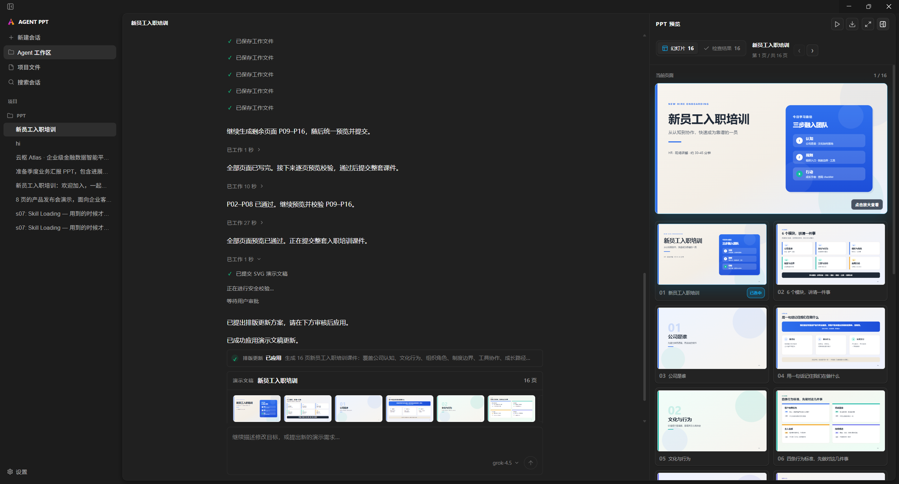
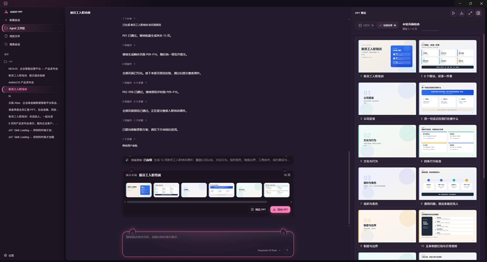
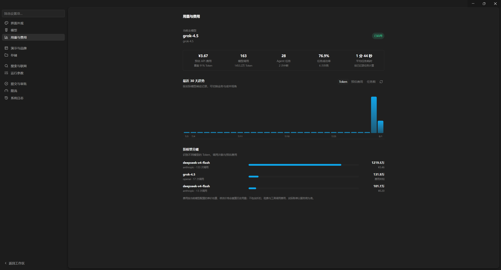
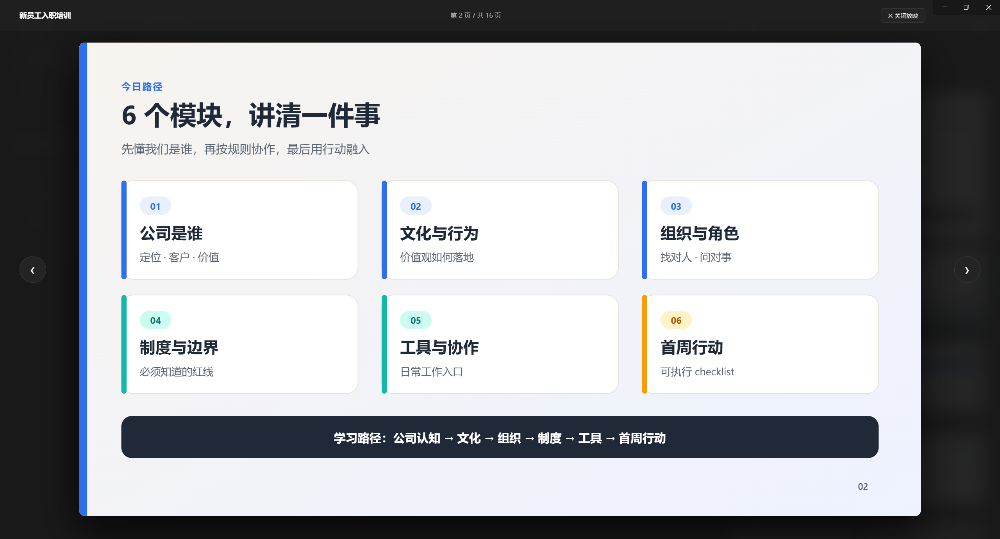
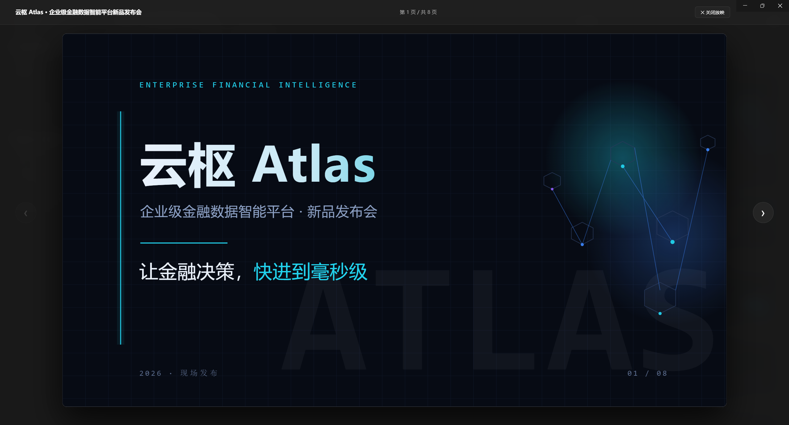

# Agent PPT Docs

[中文](./README.md) · [Product README](../README.en.md)

A local-first AI presentation workbench: the model collaborates through tools to produce reviewable SVG-native decks; code enforces safety via CommitGate, permissions, and persistence. This tree is the **architecture and contract index**. Behavior facts come from code and tests.

## UI and customization

Three-column workbench (sessions / agent progress and approvals / PPT mirror). Workbench appearance can be customized with `~/.agent-ppt/themes/<name>/theme.css` and does **not** affect the slide DesignSystem or PPTX export. Screenshots below show the UI shell and sample agent output.

<table>
  <tr>
    <td width="50%"> Three-column workbench (default look)</td>
    <td width="50%"> Custom workbench CSS theme (Catnip)</td>
  </tr>
  <tr>
    <td width="50%"> Settings: usage and billing</td>
    <td width="50%"> Slideshow: structured page sample</td>
  </tr>
  <tr>
    <td width="50%"> Slideshow: dark creative cover sample</td>
    <td width="50%"></td>
  </tr>
</table>

Customization recipes: [CSS theme guide](./user-manual/css-themes.md). Contracts: [Workbench UI themes](./architecture/ui-themes.md).

## What belongs here

This tree keeps only three kinds of content:

- **Current architecture**: stable contracts the code obeys
- **Active target contracts**: converging boundaries that must not reintroduce old designs
- **Active proposals or implementation records**: mark unrealized work `Proposed`; mark landed roadmaps `Implemented`

Superseded implementation plans are not archived in the main tree.

## Start here

| Doc | Content |
|---|---|
| [Architecture overview](./architecture/overview.md) | Five layers, data flow, state boundaries, autonomy |
| [Engineering capability map](./architecture/engineering-capabilities.md) | Capability placement, maturity, gaps, verification entry points |
| [Capability scorecard](./architecture/capability-scorecard.md) | 0–10 domain scores (includes workbench CSS/UI themes); opinion snapshot, not a behavior contract |
| [Observability](./architecture/observability.md) | JSONL logs, correlation IDs, levels, redaction, capacity |
| [Workbench UI themes](./architecture/ui-themes.md) | `themes/<name>/theme.css`, semantic tokens, `data-ui-region` |
| [Query](./agent/query.md) | QueryParams, QueryState, IterationWorkspace, identity and recovery |
| [Agent Loop](./agent/loop.md) | Independent AsyncGenerator, explicit outcomes, tool batches and events |
| [Agent Runtime](./agent/runtime.md) | Service, RunFactory, RunScope, Runtime, Finalizer |

## User manuals

| Doc | Content |
|---|---|
| [User manual index](./user-manual/README.md) | Usage and customization entry (Chinese) |
| [CSS theme guide](./user-manual/css-themes.md) | Workbench themes: capability list, variables, recipes (Chinese) |

## Agent system

| Doc | Content |
|---|---|
| [Tools](./agent/tools.md) | ToolDefinition, dynamic resolution, single execution pipeline, permissions |
| [File operations](./agent/file-operations.md) | Glob / Read / Write / Edit, read-before-write, atomic replace |
| [System prompt and context](./agent/system-context.md) | Stable/dynamic partitions, Section Registry, advisory skill stages |
| [Persistence and recovery](./agent/persistence.md) | History, checkpoint, lease, inflight recovery |
| [Multi-agent](./agent/multi-agent.md) | TaskStore, teammates, mailbox, background tasks |

## Presentation system

| Doc | Content |
|---|---|
| [Workflow and state](./presentation/workflow.md) | SVG-native create path, artifacts, Proposal, CommitGate |
| [Presentation artifact and job lifecycle](./roadmap/presentation-lifecycle.md) | Query / PptJob / ArtifactRevision, recovery, data root |
| [Visual expression system](./presentation/visual-system.md) | DesignSystemV2, SVG `visualSource`, three-end rendering |

## Active roadmap

| Doc | Status |
|---|---|
| [Presentation template management](./roadmap/template-management.md) | Proposed; SVG-native aligned; auto-select / reference upload / master staging |

## Core design constraints

1. The Query loop is an independent `AsyncGenerator`, not embedded in UI or a fixed PPT stage machine.
2. `QueryParams → QueryState → IterationWorkspace` is the only Query state hierarchy.
3. Observation events are projections only; they must not become a second source of truth.
4. Tools resolve dynamically from current context; registration does not imply always-visible.
5. The main agent may use safe Glob/Read/Write/Edit directly; teammates are not required for file writes.
6. Overwrite/Edit requires read-before-write; text writes use atomic replace.
7. Skill stage only affects recommendation and ranking, not a permission allow-list.
8. System prompt uses a stable prefix, dynamic suffix, and Section Registry.
9. Permissions, tool pairing, CommitGate, and persistence invariants are enforced in code, not Prompt.
10. `QueryId` covers one request; each `PresentationId` has one long-lived `PptJob`; `ArtifactRevision` proves validated stage output. Identities stay separate from `runId` / `threadId`.
11. Project file management only projects current workspace files; text saves require an isolated `editToken` and SHA-256 version and are not artifact revisions.
12. The product create path is Agent SVG-native only (`PreviewSvgPage` → `SubmitSvgDeck`). `executionStrategy` is an approval policy, not a create mode.
13. Query completed, Proposal ready, Presentation applied, and Export completed are four independent facts; the renderer consumes read-only `PptJobProjection`.
14. App persistent data lives under `~/.agent-ppt` (including `themes/`); Electron userData is under `~/.agent-ppt/electron`; workspaces stay in the user project directory.
15. Workbench UI themes change only the app chrome, not DesignSystem / SVG paper / PPTX export.
16. In the current dev stage there is no AppData backfill or migration; developers clean old paths manually.

## Current refactor status

| System | Status | Current boundary |
|---|---|---|
| Query / Loop | Implemented | Independent AsyncGenerator; Params/State/Workspace; full batch commit |
| Runtime | Implemented | Lifecycle facade; assembly, loop, and finalization separated |
| Model Context | Implemented | Canonical compact, request-scoped projection, max-output recovery |
| Tools | Implemented | Dynamic availability; unified permission/hook/execution pipeline |
| System Prompt | Implemented | Section Registry; stable/dynamic boundary; advisory stages |
| File operations | Implemented | Read receipt, exact Edit, conflict detection, protected commit |
| Project file management | Implemented | design-spec / page-plan / Page SVG as first-class; CAS edits |
| SVG-native create | Implemented | DesignSpec → PagePlan → PageSvg → Preview → Proposal |
| Presentation lifecycle | Implemented | Cross-query PptJob; revision/stale; apply/export side-effect recovery |
| Application data root | Implemented | SQLite, blobs, logs, runtime, token usage, `themes/` → `~/.agent-ppt` |
| Workbench UI themes | Implemented | `themes/<name>/theme.css` injection, semantic tokens, `data-ui-region` |

## Doc maintenance rules

- After a code refactor lands, update current docs and delete the corresponding stage plan.
- Active proposals must stay marked `Proposed`; do not write them as present tense fact.
- Landed roadmaps kept for architecture or dev data-policy reasons must stay marked `Implemented` and stay in sync with workflow docs and this index.
- Cite real paths; when moving files, check links (including CN/EN indexes and `../images/`).
- Prefer types, tables, or diagrams for state transitions over vague progress prose.
- New rules are either model advice or code invariants; only the latter enter Runtime/Policy.
- Keep `README.md` and `README.en.md` structurally aligned; update both when screenshots change.
