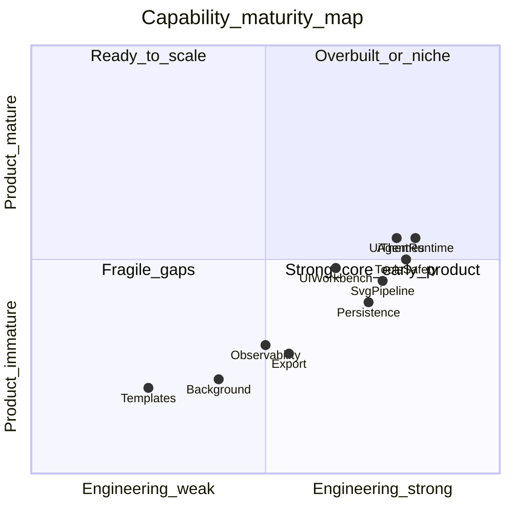

# Agent PPT 系统能力评价（完整评分）

> 文档类型：能力评价快照（非行为契约）
> 评分日期：2026-08-02
> 事实来源：`docs/architecture/engineering-capabilities.md`、`docs/architecture/ui-themes.md`、`src/`、`tests/`

本文是对工程能力地图的**量化评价**，不替代现行架构契约。行为事实仍以代码与测试为准。

## 评分标尺

| 分数 | 等级 | 含义 |
|---|---|---|
| 9–10 | Production-ready | 可对外部用户长期承诺；迁移、威胁模型、质量证据齐全 |
| 7–8.9 | Solid | 主链路正确、有测试与文档契约；缺生产硬化 |
| 5–6.9 | Early | 可用但缺口明显，方差大或产品闭环不全 |
| 3–4.9 | Fragile | 易误导/易回归，或半成品 |
| 0–2.9 | Missing / N/A | 未建或明确不采用 |

参照系：相对「本地 Electron Agent 演示工作台」目标打分，**不是**相对 Google Slides / 生产多租户 SaaS。

---

## 总分卡

| 大类 | 加权 | 类均分 | 加权贡献 |
|---|---|---|---|
| A. Agent 工程运行时 | 25% | **8.1** | 2.03 |
| B. 安全与一致性 | 20% | **7.9** | 1.58 |
| C. Presentation / SVG 领域 | 20% | **6.4** | 1.28 |
| D. 产品体验与交付（含 CSS 主题） | 20% | **6.3** | 1.26 |
| E. 工程卫生与可运营 | 15% | **6.2** | 0.93 |
| **综合** | 100% | | **7.1 / 10** |

**一句话：** 工程内核 Solid（约 8），工作台 CSS/主题 Solid（约 7.2），产品交付 Early（约 6.3），综合 **7.1（Early–Solid 交界）**。Grammar 残骸清扫已收工；短板转向模板产品与风险专项。

---

## A. Agent 工程运行时（类均 8.1）

| 维度 | 分 | 等级 | 依据摘要 |
|---|---|---|---|
| Query / Loop 架构 | **8.5** | Solid | 独立 AsyncGenerator；Params/State/Workspace；配对提交 |
| Run 生命周期 / Finalizer | **8.0** | Solid | lease、装配与终态分离 |
| Model Gateway | **8.0** | Solid | Anthropic+OpenAI 中性协议；错误/路由/流测较全 |
| 模型调用恢复 | **8.0** | Solid | 压缩、截断续写、fallback、thinking-only 恢复 |
| Context 压缩与预算 | **8.0** | Solid | micro/snip/canonical/emergency 分层 |
| System Prompt / Skill | **8.0** | Solid | Section Registry；Skill 建议化；stages 仅 frontmatter；叙事 Skill 已收敛为 Lead 直写 |
| 动态工具系统 | **8.0** | Solid | Core/Deferred/Runtime；统一 permission/hook 管线 |
| Task / Teammate | **6.5** | Early | 基本协作在；非作者主路径，产品闭环浅 |
| 后台执行平台 | **4.5** | Fragile | manager 有；无 daemon/跨进程/退出语义（文档 Partial） |
| **A 类均** | **8.1** | | 去掉后台后核心约 8.0+；含后台拉低 |

---

## B. 安全与一致性（类均 7.9）

| 维度 | 分 | 等级 | 依据摘要 |
|---|---|---|---|
| CommitGate / Proposal | **8.5** | Solid | 沙箱+diff+risk；写入不可 Prompt 绕过 |
| 工具权限与审批 | **8.0** | Solid | Preflight / approval broker 代码强制 |
| 文件 CAS / 原子写 | **8.5** | Solid | receipt、Edit 精确匹配、Main/teammate 同语义 |
| 项目文件编辑安全 | **8.0** | Solid | editToken + SHA-256；deck/history 只读 |
| 信任边界（凭据/本地） | **7.5** | Solid | Main-only `safeStorage`；Renderer 持久化/run IPC 无 Secret；Linux `basic_text` 明确降级 |
| 产品边界克制 | **8.0** | Solid | 故意不做 MCP/任意 Shell/Computer Use（加分） |
| CSS 主题路径隔离 | **7.0** | Solid | 固定 `themes/` 根、体积上限、路径穿越拒绝；**不做**选择器 sanitize |
| **B 类均** | **7.9** | | 写入与凭据边界较强；Linux 降级后端仍需显式提示；主题安全为目录沙箱而非 CSS 消毒 |

---

## C. Presentation / SVG 领域（类均 6.4）

| 维度 | 分 | 等级 | 依据摘要 |
|---|---|---|---|
| SVG-native 创建管线 | **8.0** | Solid | design-spec→page-plan→SVG→Preview→Submit→Gate |
| Preview / 质量门禁 | **7.5** | Solid | PreviewReceipt、deck validators、quality gate |
| PptJob / Artifact 生命周期 | **8.0** | Solid | 跨 Query Job、revision/stale、side-effect claim |
| DesignSystemV2 | **7.0** | Solid | schema/preset 在；与模型发挥耦合 |
| 商业视觉质量稳定性 | **4.5** | Fragile | 高度依赖模型；无规模化评分证据（P1） |
| 模板 / 母版 / 参考上传 | **2.5** | Missing | Proposed only |
| **C 类均** | **6.4** | | 管线 Solid，质量与模板拖后腿 |

说明：幻灯片 DesignSystem **不属于**工作台 CSS 主题；二者刻意分离（改皮肤不改导出 PPT）。

---

## D. 产品体验与交付（类均 6.3）

| 维度 | 分 | 等级 | 依据摘要 |
|---|---|---|---|
| 工作台 UI（三栏/审批/镜像） | **7.0** | Solid | 主流程可用；状态认知成本高 |
| 工作台 CSS / UI 主题管理 | **7.2** | Solid | 见下方拆分；Implemented |
| 审批 / 四完成态 UX | **6.0** | Early | 协议正确；用户易混淆 Query/Proposal/Applied/Export |
| 放映 / 预览 WYSIWYG | **7.5** | Solid | SVG 同源预览强 |
| PPTX 导出可用性 | **5.5** | Early | 能导出；多为整页图，非可编辑原生形状 |
| Office/WPS/Keynote 兼容 | **4.0** | Fragile | 人工抽查，无 CI 矩阵 |
| 检索（Web/图片） | **6.5** | Early | 工具在；失败场景与素材质量证据不足 |
| 设置 / 用量费用 | **6.5** | Early | 有 UI；非运营级计费 |
| **D 类均** | **6.3** | | 纳入 CSS 主题后由 ~5.3 上修 |

### D-CSS. 工作台 CSS / UI 主题拆分（综合 7.2）

事实来源：[ui-themes.md](./ui-themes.md)、[CSS 主题指南](../user-manual/css-themes.md)、`src/main/ui-themes.ts`、`src/renderer/src/styles/`、`tests/ui-themes.test.ts`。

| 子维度 | 分 | 等级 | 依据摘要 |
|---|---|---|---|
| Semantic token 契约 | **8.0** | Solid | `semantic.css` + 明暗双轴；推荐 `:root[data-skin][data-color-scheme]` 特异度 |
| `data-ui-region` 区域钩子 | **7.5** | Solid | sidebar / composer / canvas / settings；组件 class 明确非公共 API |
| 主题发现与加载 | **7.5** | Solid | `~/.agent-ppt/themes/<id>/theme.css`；IPC list/read/open；叠加注入 `<style id="user-ui-theme">` |
| 内置皮肤与示例 | **7.5** | Solid | Studio 底座 + Catnip 内置；首次写入 example；设置「界面外观」切换 |
| UI ↔ DesignSystem 分离 | **8.5** | Solid | 主题不碰纸面/导出；design-spec 不换工作台壳——边界清晰 |
| 用户定制 UX | **7.0** | Solid | 打开根目录、刷新列表、`uiThemeId` 持久化；未知 id 回退 Studio |
| 主题包资源能力 | **4.5** | Fragile | 本轮不加载 `url(./bg.png)`；无 zip/市场/远程 URL（刻意收窄） |
| CSS 注入安全深度 | **5.5** | Early | 目录隔离+256KB 上限有测；**明确不做**选择器白名单；CSP `unsafe-inline` |
| 样式工程文档 | **8.0** | Solid | architecture + user-manual + `styles/README.md` 三层说明 |
| **CSS 综合** | **7.2** | Solid | 契约与分离优秀；资源包与 sanitize 故意不做拉低上限 |

---

## E. 工程卫生与可运营（类均 6.2）

| 维度 | 分 | 等级 | 依据摘要 |
|---|---|---|---|
| 架构文档与契约 | **8.0** | Solid | docs 索引、能力地图与代码大体对齐 |
| CSS/主题文档与测试 | **7.5** | Solid | ui-themes 架构+手册；`ui-themes.test.ts` / `user-ui-theme.test.ts` |
| README / 对外叙事准确性 | **5.0** | Early | 仍有双路径/原生元素等过时表述 |
| 死代码 / Grammar 清理 | **7.5** | Solid | 作者工具与 Grammar/layout 共享库已删；空 Deferred 壳有意保留且不进默认注册表 |
| 单元测试密度 | **7.5** | Solid | ~140 tests；Runtime/Gate/生命周期/主题覆盖好 |
| 集成 / E2E 质量证据 | **3.5** | Fragile | 仅可选网关集成；视觉/Office 人工；主题多为手工验收 |
| 可观测性（日志/关联） | **6.0** | Early | JSONL + 关联身份；无 metrics 平台 |
| 数据迁移 / 升级耐久 | **3.0** | Fragile | dev 明确不迁移旧 AppData |
| Typecheck / 构建纪律 | **8.0** | Solid | strict TS；typecheck+build 脚本清晰 |
| **E 类均** | **6.2** | | Grammar 清扫完成后卫生分回升；E2E/迁移仍拖后腿 |

---

## 雷达式摘要

| 轴 | 分 |
|---|---|
| Agent Runtime | 8.1 |
| 安全一致性 | 7.9 |
| SVG/领域管线 | 6.4 |
| 产品交付（含 CSS） | 6.3 |
| 其中：工作台 CSS/主题 | **7.2** |
| 工程可运营 | 6.2 |
| **综合加权** | **7.1** |

最高：**Query / CommitGate / 文件 CAS（8.5）**；**UI↔DesignSystem 分离（8.5）**。  
最低：**模板（2.5）、数据迁移（3.0）、E2E 质量证据（3.5）**。  
CSS 谷底：**主题包本地资源（4.5）、CSS sanitize（5.5）**——多为刻意边界，非遗漏实现。

---

## 结论

| 问题 | 答案 |
|---|---|
| 综合多少分？ | **7.1 / 10**（凭据边界加固；Grammar 清扫收工后工程卫生回升） |
| CSS/主题多少分？ | **7.2 / 10（Solid）**——token/区域契约与加载链路成熟；资源包与消毒不做 |
| 最强什么？ | Agent 协议、CommitGate、文件 CAS、UI/幻灯片视觉轴分离 |
| 最弱什么？ | 模板、迁移、E2E 视觉/Office 证据、Linux 凭据降级后端 |
| 怎么用这个分？ | 按「严肃本地 Agent×PPT + 可换肤工作台」合理；按「主题市场/生产 SaaS」会高估 |

### 下一工作流（清扫已收工；勿再并入死代码轮次）

**产品主线（已选定）：模板管理**  
优先落地 [template-management.md](../roadmap/template-management.md)（Proposed → 实现）：内置 catalog、项目 policy、与 `design-spec` 单锁对齐。  
**不**把「PPTX 原生可编辑图表/形状」并作本轮主线——现行整页 SVG 导出可接受；原生图表另开导出专项。

**风险 backlog（独立专项，不并入清理轮）：**

| 项 | 当前分 | 说明 |
|---|---|---|
| Linux 凭据后端降级 | 6.0 | `safeStorage` 选择 `basic_text` 时可继续使用，但必须显示 `degraded`，不能视为安全后端 |
| 后台 daemon / 跨进程 | 4.5 | 现有 background manager ≠ daemon；退出/恢复语义另开平台专项 |
| E2E / 商业视觉证据 | 3.5 | 网关集成 + 导出人工矩阵；`evaluation.ts` 不是产品门禁 |
| Office 兼容矩阵 | 4.0 | 人工验收为主 |
| AppData 迁移 | 3.0 | 当前无 backfill；是否做由产品决定 |

提分顺序：

1. 模板协议 Phase 1（产品主线）
2. 真实网关 + 导出人工验收矩阵（风险/质量 backlog）
3. Linux 安全凭据服务配置与降级提示验证（安全 backlog）
4. 若需要主题氛围图，再评估本地 `url()` 资源加载（仍保持无远程主题）

上述加固属于本地安全与工程卫生，不代表发布、代码签名或平台公证已经完成。

## 维护

- 能力状态变化时，先更新 [工程能力地图](./engineering-capabilities.md)，再视需要修订本评分快照的日期与分数。
- 本文件是评价意见，不是 Runtime 不变量；不得用分数替代代码契约。
